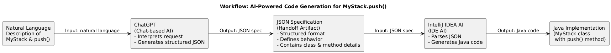

Phase 1: Problem Identification (Task to Improve)
========================================
Task Chosen: Implementing a Custom Stack (MyStack) in Java
---------------------------------------------------------

Although Java provides built-in data structures such as Stack and Deque, there are many real-world scenarios where developers still need to implement a custom stack. These include learning environments, technical interviews, constrained systems, and situations where full control over memory, behavior, or validation logic is required.

Why a Custom Stack Is Needed

A custom MyStack implementation is necessary when:

Learning and interviews:
Developers are often required to implement core data structures from scratch to demonstrate understanding of algorithms and data handling.

Customization and control:
Built-in stacks may include unnecessary features or behaviors. A custom stack allows:

Fixed-size memory control

Custom overflow handling

Simplified logic tailored to a specific use case

Performance or constraint-based systems:
In embedded systems, academic projects, or performance-sensitive applications, developers may avoid built-in abstractions and implement minimal, optimized structures.

Code generation and automation use cases:
This project focuses on automating code creation, not replacing Java’s standard library. The goal is to demonstrate how AI can generate correct, structured code when a custom implementation is required.

The Manual Problem
-----------------

Even though the logic of a stack is well-known, implementing it manually still involves:

Defining internal storage (array and index management)

Handling edge cases (stack overflow)

Writing consistent, readable Java code

These steps are repetitive and time-consuming, especially for small but essential functions like push.

What This Project Improves
------------------------

This project improves the process by using an AI-powered workflow to automatically generate a custom push(int value) function for a MyStack class, reducing manual effort while preserving correctness and flexibility.

Scope of the Task

**Data Structure:** Custom Stack

**Language:** Java

**Class Name:** MyStack

**Function Implemented:** push(int value)

Implementation Type: Array-based stack with fixed size

AI Tools Used:
---------------
This project uses ChatGPT as a Chat-based AI to convert a natural language description of a custom MyStack requirement into a structured specification (JSON) defining the stack function’s behavior. The generated specification is then passed to IntelliJ IDEA’s IDE AI, which uses it to produce the actual Java implementation of the push(int value) method. Together, these tools demonstrate a simple AI-to-AI workflow from problem definition to executable Java code.

Phase 2: Design the Workflow
===========================
Workflow Overview
-----------------

The workflow is designed to move from problem understanding to code generation by chaining outputs between two AI tools. The key idea is that the output of ChatGPT becomes the direct input for IntelliJ IDEA’s AI.

Data Flow Between Tools
-----------------------

**Tool 1** – ChatGPT (Chat AI)

**Input:** A natural language description of the custom MyStack requirement

**Output:** A structured JSON specification describing the push(int value) method

Tool 2 – IntelliJ IDEA (IDE AI)
-------------------------------

**Input:** The JSON specification generated by ChatGPT

**Output:** A Java implementation of the push(int value) method inside the MyStack class

The JSON specification acts as the handoff artifact that connects the two tools.

**First-Pass Prompts**
------------------------
**Prompt 1** – ChatGPT (Specification Generation)

`Generate a JSON specification for a custom Java stack implementation.
The stack should be called MyStack and use an array-based approach.
Include:`
- `Method name`
- `Parameters and types`
- `Method logic`
- `Constraints such as stack overflow handling`
  `Focus only on the push(int value) method.`

**Prompt 2 – IntelliJ IDEA (Code Generation)**
---------------------------------------

`Using the following JSON specification, generate the Java code
for the push(int value) method inside a MyStack class.
Assume the stack uses an int array, a top index, and a fixed maximum size.`

**Key Design Focus**
--------------

* The workflow is tool-agnostic in logic: any Chat AI can generate the specification, and any IDE AI can generate code from it.

* The handoff is explicit and reusable: the JSON specification can be stored, reviewed, or reused.

* The workflow minimizes manual coding while maintaining clarity and correctness.

**After all the video is recorded and can be accessed using this link:**
[AI WorkFlow practical implementation video](https://www.loom.com/share/a4e8bc9490a84f2ebc1af21fa4c56a1d)
